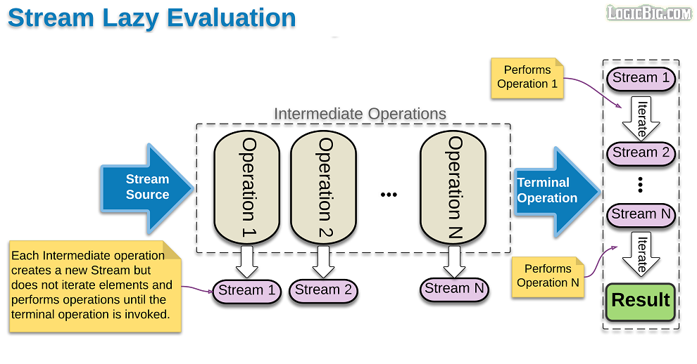

# Java 8 Streams - Lazy evaluation

Hiểu đơn giản thì lazy evaluation tức là:

- Các intermediate operations sẽ KHÔNG được thực thi cho tới khi terminal operation được gọi. Các intermediate operations
- Các intermediate operations chỉ return 1 stream mới, chứ KHÔNG động chạm tới source data!

Streams are lazy because **intermediate operations** are NOT evaluated **until terminal operation is invoked**.

Each intermediate operation **creates a new stream**, stores the provided operation/function and return the new stream.

The pipeline accumulates these newly created streams.

The time when terminal operation is called, traversal of streams begins and the associated function is performed one by one.

Parallel streams don't evaluate streams 'one by one' (at terminal point). The operations are rather performed simultaneously, depending on the available cores

Ref: https://www.logicbig.com/tutorials/core-java-tutorial/java-util-stream/lazy-evaluation.html